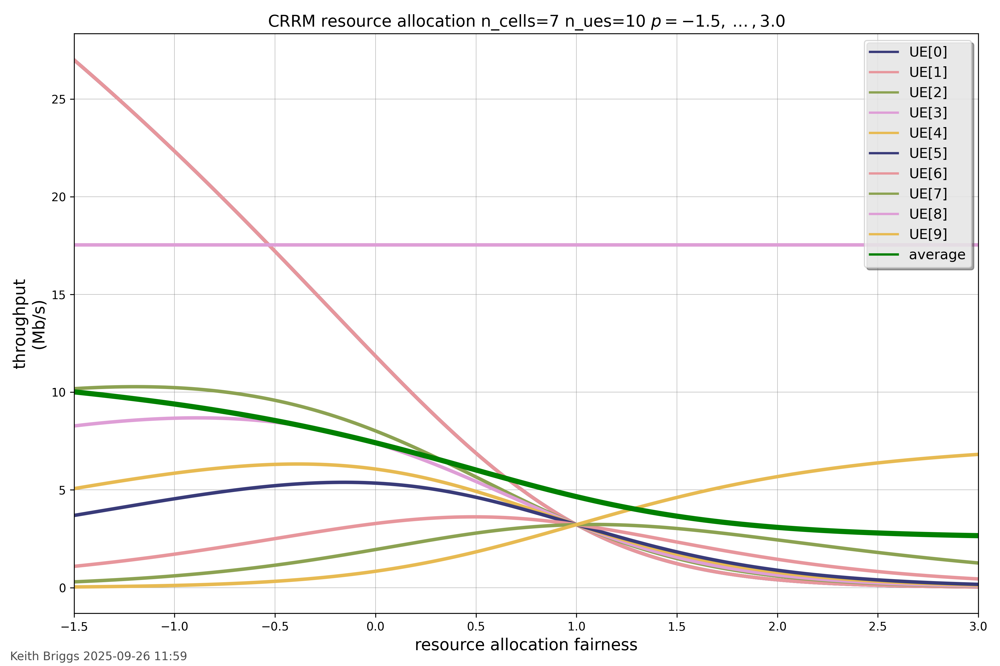

.. Keith Briggs 2025-09-23
.. https://sphinx-doc-zh.readthedocs.io/en/latest/genindex.html
.. https://bashtage.github.io/sphinx-material/rst-cheatsheet/rst-cheatsheet.html
.. # with overline, for parts
.. * with overline, for chapters
.. = , for sections
.. - , for subsections
.. ^ , for subsubsections
.. " , for paragraphs

.. CRRM documentation master file
   Indices and tables
   ------------------

   * :ref:`genindex`
   * :ref:`modindex`
   * :ref:`search`

:tocdepth: 3

.. toctree::
   :maxdepth: 2
   :caption: Contents:

CRRM documentation
##################

Last modified: |today|

Purpose
=======

CRRM stands for Cellular Radio Reference Model. This is a system-level network simulator which aims to predict the performance of a cellular radio system. It follows 5G concepts and channel models. The intention is to have an easy-to-use and fast system written in pure Python with minimal dependencies. It is especially designed to be suitable for interfacing to AI engines such as ``tensorflow`` or ``pytorch``. One of the main application areas is testing the performance of novel network management algorithms.

CRRM is carefully designed to be very fast and to be able to handle large systems. It achieves this by a novel compute-on-demand mechanism, whereby internal data is only computed when needed. Moreover, only data which is known to have changed, normally because of User Equipment (UE) movement, is actually computed. The system knows internally what has not changed and thus does not need to be re-computed.

CRRM builds on the previous projects `AIMM-simulator <https://github.com/keithbriggs/AIMM-simulator>`_ by Keith Briggs, and `Cellular Reference Model <https://github.com.mcas.ms/apw804/CellularReferenceModel>`_ by Kishan Sthankiya, especially for pathloss models. However, CRRM has a completely new and much more efficient internal design and a new API, and essentially is a new project.

Authors
^^^^^^^

- Keith Briggs (BT Research and Networks Strategy)
- Ibrahim Nur (University of Cambridge)

Software dependencies
^^^^^^^^^^^^^^^^^^^^^

1. `Python 3.11 <https://python.org>`_ or higher.
2. `NumPy <https://numpy.org/>`_.
3. `SciPy <https://scipy.org/>`_.
4. `matplotlib <https://matplotlib.org>`_.

Installation from source
^^^^^^^^^^^^^^^^^^^^^^^^

.. code-block:: bash
  :linenos:

  download zip from <https://github.com/keithbriggs/CRRM-2.0/tree/master>
  unzip CRRM-2.0.zip
  cd CRRM-2.0
  pip install .

Performance
^^^^^^^^^^^

The plot below shows the typical computation time for a range of system sizes. Note the proportionality of computation to both the number of cells, and to the number of UEs.  This indicates that there are no significant computational overheads.

Download script: :download:`CRRM_large_system_timing_tests.py <../../CRRM_large_system_timing_tests.py>`

.. figure:: ../../img/CRRM_large_system_timing_tests.png
   :alt: CRRM_large_system_timing_tests.png
  
   CRRM performance metrics.

.. raw:: html

    

Tutorial examples
=================

**Note**: as with other python packages like `numpy`, there are alternative ways of importing which are functionally equivalent but result in a different namespace set-up.  With `CRRM`, these two options are equivalent:

.. code-block:: python
  :linenos:

  from CRRM import Simulator,Parameters
  params=Parameters()
  sim=Simulator(params)
  # or...
  import CRRM
  params=CRRM.Parameters()
  sim=CRRM.Simulator(params)

**Important**: the parameters class is used to set the *initial* conditions for the simulation. If these are changed during a simulation run, it is not safe to assume that the new values will be used by the simulation kernel. For only a few parameters is it meaningful to change them during a run, and for these methods with names like  :any:`CRRM.Simulator.set_power_matrix()` methods are provided. See the documentation of all available such methods under :any:`Simulator` below.

Example 01: Quick start
^^^^^^^^^^^^^^^^^^^^^^^

The following example will test the installation and introduce the basic concepts.  

.. code-block:: python
  :linenos:

  from CRRM import Simulator,Parameters
  crrm_parameters=Parameters(n_ues=20)
  crrm_simulator=Simulator(crrm_parameters)
  crrm_simulator.layout_plot()
  crrm_simulator.update()
  print(f'UE throughputs={crrm.get_UE_throughputs()} Mb/s')
  
The minimal steps required to build and run a simulation are:

1. Import ``Simulator``, and ``Parameters``.
2. Create a ``Parameters`` instance.
3. Create a ``Simulator`` instance with the ``Parameters`` instance as its only argument.
4. Draw a plot to confirm the system layout (see below).
5. Call the ``update`` method on the ``Simulator`` instance. 
6. Print out the computed values of any variables of interest.

The output should be something like this:

.. code-block::

  UE throughputs=[16 16  9  7  5  9 16 33 33  8 33 28 16 43 43 16 22 29 66 26] Mb/s

Note that the default locations for cells and UEs used are 7 cells in a hexagonal layout, and UEs distributed as a Poisson Point Process (PPP), with mean 50 (in the approximate area covered by the cells). These default locations can be over-ridden by using the ``cell_locations`` and ``ue_initial_locations`` arguments when creating the ``CRRM_parameters`` instance. In this example we simply use the `n_ues` parameter to use 20 UEs rather than the default 50, but we keep the PPP distribution.

Download script: :download:`CRRM_example_01_quick-start.py <../../CRRM_example_01_quick-start.py>`

  
   CRRM example 01 quick-start layout.

Example 02: Adding a logger
^^^^^^^^^^^^^^^^^^^^^^^^^^^

Normally we want to log or capture data during a simulation run, in order to plot it at the end of the run, or to do statistical analyses.  The `Logger` class is used for this, as outlined in this code example:

.. code-block:: python
  :linenos:

  from CRRM import Parameters,Simulator,Logger
  crrm_parameters=Parameters(...)
  crrm=Simulator(crrm_parameters)
  logger=Logger(crrm,captures=('cqi','mcs','sinr','se_Shannon','tp'))
  for i in range(crrm_parameters.n_moves):
    logger.capture()
    # now move some UEs...
  logger.plot(fields=('cqi','mcs','sinr','se_Shannon','tp'),
              fnbase='img/CRRM_example_02_logger',
              title='CRRM logger',
              averages=('tp',),
              smooth_averages=True)

1. Import the required classes.
2. Create a `Parameters` instance.
3. Create a `Simulator` instance.
4. Create a `Logger` instance, specifying which quantities are to be captured, and optionally for which UEs (the default is all UEs).
5. Start the main simulation loop.
6. On each loop iteration, capture the data.
7. Move some or all UEs according to some mobility model.
8. Plot the results. The `averages` field causes the average of the captured data to also be plotted.

Download script: :download:`CRRM_example_02_logger.py <../../CRRM_example_02_logger.py>`

  
   CRRM example 02: logger.

Example 03: Resource allocation
^^^^^^^^^^^^^^^^^^^^^^^^^^^^^^^

This example demonstrates the ``resource_allocation_fairness`` parameter (denoted as :math:`p`). This parameter controls how resources are shared among UEs attached to the same cell. The model calculates the throughput :math:`T_i` for a user :math:`i` with spectral efficiency :math:`S_i` using the equation :math:`T_i = a S_i^{1-p}`. Here, :math:`p` is the fairness parameter, and :math:`a` is a proportionality factor calculated for each cell, which represents the total subband bandwidth divided by the sum of the "costs" (:math:`S_j^{-p}`) of all UEs attached to that same cell. The script plots the throughput of all UEs as this parameter is swept from a negative value (favouring strong users) to a positive value (favouring weak users).

.. code-block:: python
  :linenos:

  crrm_parameters=Parameters(..., resource_allocation_fairness=pmin, ...)
  crrm=Simulator(crrm_parameters)
  crrm_log=Logger(crrm, captures=('tp',), ...)
  ps=np.linspace(pmin, pmax, crrm_parameters.n_moves)
  for p in ps:
    crrm.set_resource_allocation_fairness(p)
    crrm_log.capture()
  crrm_log.plot(fields=('tp',), x_axis=ps, ...)

The key steps are:

1. A `Logger` instance is created, configured to capture throughput (``tp``) for all UEs.
2. A ``numpy.linspace`` array of fairness values (``ps``) is generated.
3. The main loop iterates over this ``ps`` array, not over time steps.
4. Inside the loop, ``set_resource_allocation_fairness()`` is called to update the simulator's parameter.
5. ``logger.capture()`` logs the resulting throughputs for all UEs at this fairness value.
6. Finally, ``logger.plot()`` is called with ``x_axis=ps`` to plot throughput *vs* the fairness parameter.

Download script: :download:`CRRM_example_03_resource_allocation.py <../../CRRM_example_03_resource_allocation.py>`

  
   CRRM example 03: resource allocation.

Example 04: Pathloss model comparison
^^^^^^^^^^^^^^^^^^^^^^^^^^^^^^^^^^^^^

This script compares the available pathloss models from the simulator. It simulates a single UE moving radially away from the cell and captures its throughput at each step. This process is repeated for each long-distance model (RMa, UMa, UMi, and power-law), and the results are plotted on a single graph to show the significant impact of the propagation model on performance.

.. code-block:: python
  :linenos:

  model_names = ['RMa', 'UMa', 'UMi', 'power-law']
  all_tps = []
  for model_name in model_names:
    crrm_parameters = Params(..., pathloss_model_name=model_name, ...)
    crrm = Sim(crrm_parameters)
    tp = np.empty(n_points)
    for i in range(n_points):
      tp[i] = crrm.get_UE_throughputs()[0, 0] 
      crrm.move_ue_locations(...) 
    all_tps.append(tp)
  plot(distances, all_tps, labels=model_names, ...)

The key steps are:

1. Define the list of models to iterate over.
2. Create an empty list to store the final throughput array from each run.
3. Begin the main loop, iterating over the model names.
4. Inside the loop, create a new `Params` instance, critically setting the ``pathloss_model_name`` for this iteration.
5. Create a new `Sim` instance for this model.
6. Run the inner simulation loop, moving the UE and capturing throughput into a temporary array ``tp``.
7. Append the completed throughput array ``tp`` to the main ``all_tps`` list.
8. After the main loop, pass all the collected data to the plot function.

Download script: :download:`CRRM_example_04_pathloss_model_comparison.py <../../CRRM_example_04_pathloss_model_comparison.py>`

The script prints simulation progress to the console and generates the plot shown below. Note how the simple ``power-law`` model (exponent 3.0) is more pessimistic at short distances than the dual-slope 3GPP models (like RMa), which start with a pathloss exponent closer to 2.0.

  
   Throughput *vs* distance for several standard pathloss models.

Example 05: Antenna pattern visualisation
^^^^^^^^^^^^^^^^^^^^^^^^^^^^^^^^^^^^^^^^^

This script provides a visualisation of the 3-sector antenna gain pattern model. It plots the throughput of a single UE moving in a 360-degree circle at a constant radius from the cell. The test is run for both the 1-sector (omnidirectional) case and the 3-sector case, allowing a direct comparison.

.. code-block:: python
  :linenos:

  thetas   = np.linspace(-np.pi, np.pi, n_steps, ...)
  xs       = r_m * np.cos(thetas) 
  ys       = r_m * np.sin(thetas)
  ...
  all_tps = []
  for n_sec in [1, 3]:
    crrm_parameters = Params(..., n_sectors=n_sec, ...)
    crrm = Sim(crrm_parameters)
    tp = np.empty(n_steps)
    for i in range(n_steps):
      pos = np.array([[xs[i], ys[i], h_ut]])
      crrm.set_ue_locations([0], pos)
      tp[i] = crrm.get_UE_throughputs()[0, 0]
    all_tps.append(tp)
  plot(degrees, all_tps, ...)

The core logic is:

1. Generate the array of :math:`(x, y)` coordinates for the circular path.
2. Loop over the desired sector configurations (1 and 3).
3. Inside this loop, create a `Params` instance with the correct ``n_sectors`` for this run.
4. Create the corresponding `Sim` instance.
5. Run an inner loop over all path coordinates.
6. Use the ``set_ue_locations()`` method to explicitly place the UE at the position for this step.
7. Capture the UE's throughput at that position.
8. Store the throughput arrays and pass them to the plot function.

Download script: :download:`CRRM_example_05_antenna_pattern.py <../../CRRM_example_05_antenna_pattern.py>`

The resulting plot clearly shows the gain "lobes" from the 3-sector antenna pattern compared to the flat omnidirectional (1-sector) case, confirming the antenna gain model is working correctly.

  
   Plot showing 1-sector *vs* 3-sector throughput for a UE moving in a circle.

Example 06: Subbanding and Interference
^^^^^^^^^^^^^^^^^^^^^^^^^^^^^^^^^^^^^^^

This script demonstrates the use of subbanding. It defines a worst-case scenario: one UE placed exactly between two cells. In the first test (1 subband), the UE experiences full interference from both cells, resulting in near-zero SINR. In the second test (2 subbands), the cells are configured via the ``power_matrix`` parameter to transmit on different subbands, eliminating the interference at the UE and showing the resulting massive throughput gain.

.. code-block:: python
  :linenos:

  # Case 1: n_subbands=1
  params_case1 = Params(
    ...,
    n_subbands             = 1,
    power_matrix           = [[100.0], [100.0]],
    ...
  )
  crrm_case1 = Sim(params_case1)
  crrm_case1.update()
  sinr_case1 = crrm_case1.sinr.data[0, 0]
  
  # Case 2: n_subbands=2
  params_case2 = Params(
    ...,
    n_subbands             = 2,
    power_matrix           = [[100.0, 1.0], [1.0, 100.0]], 
    ...
  )
  crrm_case2 = Sim(params_case2)
  crrm_case2.update()
  sinrs_case2 = crrm_case2.sinr.data[0]

This demo runs two separate simulations:

1. A `Params` instance is created for 1 subband.
2. The ``power_matrix`` is set so both cells transmit on that single band, creating high interference.
3. The simulation is run and the resulting (low) SINR is captured.
4. A second `Params` instance is created for 2 subbands.
5. The ``power_matrix`` is set to coordinate power: Cell 0 transmits on subband 0, and Cell 1 on subband 1.
6. The simulation is run and the SINR for both subbands is captured, showing high SINR on the subband with no interference.

Download script: :download:`CRRM_example_06_subbanding.py <../../CRRM_example_06_subbanding.py>`

This script prints its results directly to the console. The output shows the SINR and throughput for both cases, demonstrating a clear performance gain.

.. code-block::

  Case 1: n_subbands=1
  UE SINR:    -0.00 dB
  UE Throughput:   17.54 Mb/s
  Case 2: n_subbands=2
  UE SINR (on subband 0): 20.00 dB (note: high signal, no interference)
  UE SINR (on subband 1): -20.00 dB (note: minimal signal)
  UE Throughput: 61.25 Mbps (note: from SB 0 only)

Example 07: Adding UEs during a run
^^^^^^^^^^^^^^^^^^^^^^^^^^^^^^^^^^^

This example demonstrates how to dynamically add UEs to a running simulation using the ``add_ue()`` method. It starts with a single cell and a single UE, then iteratively adds new UEs in a loop, printing the throughput of all UEs at each step.

.. code-block:: python
  :linenos:

  crrm_parameters=Parameters(...)
  crrm=Simulator(crrm_parameters)
  for i in range(2, 2+nmax):
    crrm.update()
    ue_throughputs=crrm.get_UE_throughputs()[:,0]
    print(f'i={i} ue_throughput={ue_throughputs}')
    crrm.add_ue(np.array([[10.0*i, 0.0, 2.0]]))

The key steps are:

1. A `Simulator` instance is created with a single cell and a single UE.
2. A loop is started to add `nmax` new UEs.
3. Inside the loop, `update()` is called to get the current state.
4. The throughputs for all *currently active* UEs are fetched and printed.
5. The ``add_ue()`` method is called with a new location, adding one more UE to the simulation for the *next* loop iteration.

The console output demonstrates the effect of cell load. As more UEs are added to the same cell, the total cell throughput is shared among them, and the per-UE throughput decreases.

Download script: :download:`CRRM_example_07_adding_ues.py <../../CRRM_example_07_adding_ues.py>`

.. code-block::

  i=2 ue_throughput=[148.126]
  i=3 ue_throughput=[74.063 74.063]
  i=4 ue_throughput=[49.375 49.375 49.375]
  i=5 ue_throughput=[37.032 37.032 37.032 37.032]
  i=6 ue_throughput=[29.625 29.625 29.625 29.625 29.625]
  i=7 ue_throughput=[24.688 24.688 24.688 24.688 24.688 24.688]

Example 08: The InH Indoor Hotspot model
^^^^^^^^^^^^^^^^^^^^^^^^^^^^^^^^^^^^^^^^

This script is a minimal example of how to select and use the ``InH`` (Indoor Hotspot) pathloss model. It sets up a simple scenario with two cells and one UE (in a high-interference, midpoint location) and prints the resulting throughput.

.. code-block:: python
  :linenos:

  crrm_parameters=Params(
    n_ues=1,
    pathloss_model_name="InH",
    ue_initial_locations=[[100.0, 0.0, 1.5]],
    cell_locations=[[0.0, 0.0, 20.0], [200, 0.0, 20.0]],
    ...
  )
  crrm=Sim(crrm_parameters)
  crrm.update()
  ue_throughput=crrm.get_UE_throughputs()
  print(f"throughput for one UE...is {ue_throughput[0,0]} Mb/s")

The key steps are:

1. A `Params` instance is created.
2. The ``pathloss_model_name`` is explicitly set to ``"InH"``.
3. A 2-cell, 1-UE layout is defined.
4. The `Sim` is created, updated, and the final throughput for the single UE is printed.

Download script: :download:`CRRM_example_08_InH.py <../../CRRM_example_08_InH.py>`

This script prints a single line to the console reporting the throughput for this specific indoor scenario.

.. code-block:: text

  throughput for one UE...is 19.4 Mb/s

Example 09: Indoor Hotspot model in 3d
^^^^^^^^^^^^^^^^^^^^^^^^^^^^^^^^^^^^^^

This is an advanced example demonstrating a 3D animated simulation using the ``InH`` model. It shows multiple UEs moving within the 3D boundaries of a building, including randomly moving between floors. The script generates a series of 3D plot frames showing the UE locations and their current throughputs, which can then be compiled into a video.

.. code-block:: python
  :linenos:

  parameters = Parameters(..., pathloss_model_name="InH", ...)
  crrm = Simulator(parameters)
  house_geom = Building(...)
  
  for step in range(n_steps):
    # ... manual UE 3D mobility logic (bouncing off walls) ...
    s_plus_Δs = s + Δs 
    # ... logic to randomly change floors (s_plus_Δs[i, 2] = ...) ...
    crrm.move_ue_locations(range(n_ues), Δs)
    throughputs = crrm.get_UE_throughputs(...)
    # ... matplotlib 3D plotting logic ...
    draw_building_3d(house_geom, dots=crrm.ue_locations.data, ...)
    ax.text(ue_loc[0],ue_loc[1],ue_loc[2]+0.5,label=f'{throughputs[i]} Mb/s', ...)
    fig.savefig(f'ani/frame_{step:04d}.png')
    plt.close()
  
  print(f"ffmpeg ... && xdg-open mp4/InH_test_ani.mp4")

The core logic is:

1. A `Params` instance is created, specifying the ``InH`` pathloss model.
2. A 3D building geometry is defined.
3. A main simulation loop begins, where custom code calculates the next UE position, including "bouncing" off the defined building walls and randomly triggering floor changes.
4. ``crrm.move_ue_locations()`` is called with the new 3D positions.
5. ``get_UE_throughputs()`` is called to get the performance at this new state.
6. A 3D plot is generated showing the building, cells, and UEs annotated with their throughputs.
7. The plot is saved as an animation frame.
8. After the loop, an `ffmpeg` command is printed to compile the frames into a video.

Download script: :download:`CRRM_example_09_InH_3d.py <../../CRRM_example_09_InH_3d.py>`

This script outputs a series of ``.png`` frames to the ``ani/`` directory and prints a command to compile and open the resulting ``.mp4`` video.

  
   CRRM example 09: Indoor Hotspot with 3d geometry.

Example 10: Base-station sectorization
^^^^^^^^^^^^^^^^^^^^^^^^^^^^^^^^^^^^^^

This example computes an average throughput, firstly with one sector per base station, and then with three.

.. code-block::

  n_sectors=1 average UE throughput over 100 UE PPP layouts = 4.22 Mb/s
  n_sectors=3 average UE throughput over 100 UE PPP layouts = 8.23 Mb/s

The layout plot indicates that the attachement is not to the nearest cell in the three-sector case.

.. figure:: ../../img/CRRM_example_10_sectors_layout.png
   :alt: CRRM_example_10_sectors_layout.png
  
   CRRM example 10 sectors layout.

Download script: :download:`CRRM_example_10_sectors.py <../../CRRM_example_10_sectors.py>`

Example 11: One-cell throughput tests
^^^^^^^^^^^^^^^^^^^^^^^^^^^^^^^^^^^^^

This example simply demonstrates that repeatedly adding UEs to a single cell results in throughputs inversely proportional to the number of UEs. See comments in the script for further details.

  
   CRRM example 11 throughput tests.

Download script: :download:`CRRM_example_11_one-cell_throughput_tests.py <../../CRRM_example_11_one-cell_throughput_tests.py>`

Example 12: Signal-to-Interference ratio cumulative distribution
^^^^^^^^^^^^^^^^^^^^^^^^^^^^^^^^^^^^^^^^^^^^^^^^^^^^^^^^^^^^^^^^

This example simply demonstrates a close match to a theoretical cumulative distribution in the case of both cells and UEs randomly distributed according to a Poisson Point Process (PPP). See comments in the script for further details.

Reference: Haenggi, *Stochastic Geometry for Wireless Networks*, CUP 2013, section 5.2.

  
   CRRM example 12 SIR cumulative distribution.

Download script: :download:`CRRM_example_12_sinr_cdf.py <../../CRRM_example_12_sinr_cdf.py>`

Example 13: Timing tests
^^^^^^^^^^^^^^^^^^^^^^^^

This script is able to run a variety of tests demonstrating the speed-ups attainable by using the smart updating algorithm in the CRRM kernel. An important check which it performs is that the smart updating gives identical results to the non-smart. It can also make an animation. See comments in the script for further details. 

Typical console output is:

.. code-block::

  Without smart updating:
  sinr for subband[0]=[-3.598  3.415 -2.172  1.317 -1.293 ... ] dB
  se_Shannon for subband[0]=[0.523 1.676 0.684 1.235 0.801 ...]

  With smart updating:
  sinr for subband[0]=[-3.598  3.415 -2.172  1.317 -1.293 ... ] dB
  se_Shannon for subband[0]=[0.523 1.676 0.684 1.235 0.801 ...]

  The smart and the non-smart results match! 
  speed-up factor=1.84 😁

Download script: :download:`CRRM_example_13_timing_tests.py <../../CRRM_example_13_timing_tests.py>`

Example 14: Fading demonstration
^^^^^^^^^^^^^^^^^^^^^^^^^^^^^^^^

A demonstration of the effects of different types of fading on a cell-edge user.

.. figure:: ../../img/CRRM_example_14_fading_tests.png
   :alt: CRRM_example_14_fading_tests
  
   CRRM example 14: fading.

Download script: :download:`CRRM_example_14_fading_tests.py <../../CRRM_example_14_fading_tests.py>`

Example 15: MIMO
^^^^^^^^^^^^^^^^

CRRM 2.0 implements MIMO only  for computing channel spectral efficiency; the UE throughput computations based on MCS selection are unaffected by this setting.

This example simply sets up a system with several different MIMO schemes, and prints the predicted UE spectral efficiencies.

.. code-block:: python

  from CRRM import Simulator, Parameters
  for MIMO in ((1,1),(2,2),(4,4),(8,2),(8,4),(8,8),(64,64),):
    crrm=Simulator(Parameters(n_ues=20,MIMO=MIMO))
    se=crrm.get_spectral_efficiency(ues=(0,1,2,3,4,5,),subbands=0)
    print(f"MIMO={MIMO} {se} b/s/Hz")

This code prints:

.. code-block::

  MIMO=( 1,  1) [  4.6    4.53   2.63  1.76  1.27  1.43] b/s/Hz
  MIMO=( 2,  2) [  7.51   7.37   4.2   2.85  2.1   2.35] b/s/Hz
  MIMO=( 4,  4) [ 14.76  14.49   8.31  5.66  4.17  4.66] b/s/Hz
  MIMO=( 8,  2) [  8.85   8.7    5.0   3.35  2.42  2.72] b/s/Hz
  MIMO=( 8,  4) [ 16.87  16.57   9.45  6.33  4.6   5.17] b/s/Hz
  MIMO=( 8,  8) [ 29.38  28.86  16.58 11.29  8.33  9.31] b/s/Hz
  MIMO=(64, 64) [234.72 230.55 132.56 90.3  66.59 74.48] b/s/Hz

Download full script: :download:`CRRM_example_15_MIMO.py <../../CRRM_example_15_MIMO.py>`

Example 16: callback demo
^^^^^^^^^^^^^^^^^^^^^^^^^

This is a very simple example of how to use the callback facility for user access to internal CRRM data during a simulation run.

.. code-block:: python

  from CRRM import Simulator, Parameters
  def show_attachments(a): print(f"attachment_vector = {a}")
  crrm = Simulator(Parameters(n_ues=20))
  crrm.a.set_callback(show_attachments)
  crrm.update()

This code prints the following. The meaning of the attachment_vector is that UE[i] is attached to cell[attachment_vector[i]].

.. code-block::

  attachment_vector = [0 0 0 0 0 1 1 2 4 4 2 5 3 1 5 3 5 3 6 3]

Download full script: :download:`CRRM_example_16_callback_demo.py <../../CRRM_example_16_callback_demo.py>`

.. raw:: html

    

CRRM internal structure and mathematical model
==============================================

Most users do not need to know anything about this.

- UE locations :math:`u_i` (one row per UE, three columns :math:`x,y,x`).
- Cells locations :math:`c_j` one row per cell, (three columns :math:`x,y,x`)
- :math:`\text{Cell}_j` transmits with power :math:`p_j` (:math:`p_{jk}` with subbands).
- Distance matrix :math:`D_{ij}=||u_i-c_j||`.
- Attachment vector: :math:`\text{UE}_i` attaches to cell :math:`a_j` with best signal.
- Gain matrix :math:`G=g(D)` (:math:`\implies0<G<1`).
- RSRP matrix :math:`R_{ij}=p_j G_{ij}`.
- With subbands: :math:`R_{ijk}=p_{jk} G_{ij}`.
- Wanted signal vector :math:`w_i=R_{i,a_i}`.
- Unwanted interference vector :math:`u_i=\sum_j R_{ij}-w_i`. 
- SINR vector :math:`\gamma=\frac{w}{\sigma^2+u}` (element-wise division). 
- CQI is computed by discretizing the SINR.
- MCS selection is done by standard look-up tables.
- Resource allocation and throughput calculation are done by the function :any:`CRRM.Simulator.get_UE_throughputs` and the class :any:`CRRM.Throughput` documented below.

The horizontal arrows in the block diagram below indicate dependencies of one block upon others. Blocks drawn with the same height have the same numbers of rows (:math:`n_{\text{UEs}}`), and blocks drawn with the same width have the same numbers of columns (either :math:`n_{\text{cells}}`, or 1). Stacks indicate the third dimension, which stores the data for each subband.

.. figure:: CRRM_block_diagram.png
   :scale: 50 %
   :alt: CRRM block diagram

   CRRM simulator block structure.

.. figure:: CRRM_block_diagram_with_strip.png
   :scale: 50 %
   :alt: CRRM block diagram with strip

   CRRM simulator block structure, with the horizontal red strip showing the rows of vectors and matrices which are updated when a UE moves.

.. raw:: html

    

API reference
=============

CRRM module
^^^^^^^^^^^

.. automodule:: CRRM
    :members: get_version
    :exclude-members:
    :no-index:

_Node class
^^^^^^^^^^^

.. automodule:: CRRM._Node
    :members: set_callback
    :exclude-members:
    :no-index:

Parameters class
^^^^^^^^^^^^^^^^

.. automodule:: CRRM.Parameters
    :members:
    :exclude-members:

Simulator class
^^^^^^^^^^^^^^^

.. automodule:: CRRM.Simulator
    :members: set_rng_seeds,set_n_sectors,set_noise_power_spectral_density,set_resource_allocation_fairness,set_ue_locations,set_power_matrix,scale_ue_locations,move_ue_locations,add_ue,layout_plot,get_rngs,get_resource_allocation_fairness,get_ue_locations,get_power_matrix,get_UE_throughputs
    :exclude-members: invert_attachment_vector,update_data

.. automodule:: CRRM
    :members: Throughput

Logger class
^^^^^^^^^^^^

.. automodule:: CRRM.Logger
    :members:
    :exclude-members: get_color

Antenna_gain class
^^^^^^^^^^^^^^^^^^

.. automodule:: CRRM.Antenna_gain
    :members:
    :exclude-members: 

RMa (Rural Macrocell) pathloss model
^^^^^^^^^^^^^^^^^^^^^^^^^^^^^^^^^^^^

.. automodule:: RMa_pathloss_model_08
   :members: RMa_pathloss,RMa_pathloss_constant_height,RMa_pathloss_discretised,plot_RMa_pathloss_or_pathgain,plot_RMa_pathloss_runtime_comparison
   :special-members:
   :exclude-members: __weakref__,PL_1_at_d_BP,d_BP,fc_GHz,h_BS,h_UT,LOS,d_BP,PL_1_at_d_BP,nlos_term_A,nlos_term_B

.. figure:: ../../img/RMa_pathloss_model.png
   :alt: RMa pathloss model

   RMa pathloss model

   RMa pathloss models, runtime comparison
 
UMa (Urban Macrocell) pathloss model
^^^^^^^^^^^^^^^^^^^^^^^^^^^^^^^^^^^^

.. automodule:: UMa_pathloss_model_06
   :members: UMa_pathloss
   :special-members:
   :exclude-members:  __weakref__,PL_1_at_d_BP,d_BP,fc_GHz, h_BS, h_UT, LOS, d_BP, PL_1_at_d_BP, nlos_term_A, nlos_term_B,_rng,_pl1_const,_nlos_const

  
   UMa pathloss model

UMi (Urban Microcell) pathloss model
^^^^^^^^^^^^^^^^^^^^^^^^^^^^^^^^^^^^

.. automodule:: UMi_pathloss_model_00
   :members: UMi_pathloss,UMi_pathloss_constant_height,UMi_pathloss_discretised
   :special-members:
   :exclude-members:  __weakref__,PL_1_at_d_BP,d_BP,fc_GHz, h_BS, h_UT, LOS, d_BP, PL_1_at_d_BP, nlos_term_A, nlos_term_B,_rng,_pl1_const,_nlos_const

.. figure:: ../../img/UMi_pathloss_model.png
   :alt: UMi pathloss model
  
   UMi pathloss model

InH (Indoor Hotspot) pathloss model
^^^^^^^^^^^^^^^^^^^^^^^^^^^^^^^^^^^^

.. automodule:: InH_pathloss_model_01
   :members:
   :special-members:
   :exclude-members: __dict__,__weakref__,_PL1,_PL2

  
   InH pathloss model

Power-law pathloss model
^^^^^^^^^^^^^^^^^^^^^^^^

.. automodule:: power_law_pathloss_model_02
   :members:
   :special-members:
   :exclude-members: __dict__,__weakref__,_PL1,_PL2

.. figure:: ../../img/power_law_pathloss_model.png
   :alt: power_law_pathloss_model
  
   Power-law pathloss model

.. raw:: html

    

Last modified: |today|
